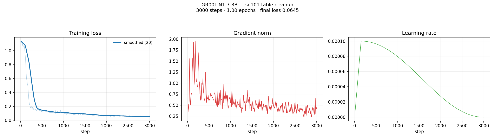

# GR00T N1.7 fine-tune + post-training quantization study

Fine-tunes NVIDIA's GR00T-N1.7-3B vision-language-action model on the SO-101
table-cleanup dataset, then asks how far the resulting policy's weights can be
compressed before it stops being a policy.

The quantization method under test is
[ApexQuant](https://github.com/sumit-ai-ml/Apexquant): rotate each layer's
fan-in axis, L2-normalize the rotated rows, and quantize the coordinates with a
Lloyd–Max codebook matched to the Beta(d/2, d/2) distribution those coordinates
follow on the sphere. Training-free — no calibration data, no gradient steps.

## What is here

```
scripts/
  env.sh              activate the venv + NVPL linker paths (source, never execute)
  make_split.py       episode-level, task-stratified train/eval split
  check_frames.py     dataset sanity checks
  train.sh            phase 4 fine-tune driver
  plot_training.py    loss / grad-norm / LR curves from trainer_state.json
  discover.py         module layout, layer inventory, fan-in audit
  quant_lib.py        in-place tower quantization + FP restore
  eval_lib.py         open-loop rollouts and the metrics the study reports
  quant_sweep.py      the (method x bits x tower) grid
  quant_report.py     comparison table + figures
splits/               the episode ids each side of the split got
runs/                 per-phase logs and the layer inventory
results/              figures, the sweep's raw jsonl, the comparison table
```

Model weights, the two external repos, and the NVPL libraries are gitignored;
see *Reproducing* below.

## The model

`nvidia/GR00T-N1.7-3B`, 3.14 B parameters in two towers:

| tower | params | quantizable layers |
|---|---:|---:|
| `backbone` (Qwen3-VL) | 1523.5 M | 217 |
| `action_head` (DiT denoiser) | 1620.5 M | 252 |

Fan-ins run 256 → 8192. The audit rates **469 of 469 layers GOOD** — every
quantizable layer sits far above the d≈32 threshold below which the Beta
approximation degrades. There are no `nn.MultiheadAttention` modules, so no
q/k/v projections hide inside a fused `in_proj_weight` where the walker would
miss them.

42.4% of parameter mass has a non-power-of-two fan-in (d=1536, d=6144) and so
falls back from SRHT to a dense d×d QR rotation. That is a quantization-time
cost — roughly 4 minutes for the whole model — not an accuracy one.

## Fine-tuning

3000 steps, global batch 16, single GB10, ~1 h 36 m. Loss 1.13 → 0.065 over one
epoch; cosine schedule annealed to zero, gradient norm settled at 0.3–0.6.



These are *training* losses. The run logged no validation metric, so the
generalization signal comes from the held-out eval split, not from this plot.

## Evaluation

Open-loop, on the 16 held-out episodes, 200 steps each. Every
`execution_horizon` steps the policy re-observes ground-truth state and predicts
the next chunk, so error accumulates within a chunk and resets at the boundary.

Three numbers per run, all normalized per-dimension by the ground truth's own
standard deviation — joint angles and the gripper differ enough in range that an
unnormalized MSE just reports whichever dimension swings widest:

- **mse** — mean normalized squared error. **MSE ≈ 1.0 is the do-nothing
  baseline**: that is what predicting the mean action and ignoring the
  observation scores. Read every number against 1.0, not against 0.
- **terminal_l2** — normalized L2 error at the last step, which per-step
  averages wash out.
- **drift_ratio** — final-quarter error over first-quarter error. Above 1 means
  error compounds.

The action head is a denoiser driven by sampled noise, so the policy is
stochastic. Every grid point runs under the same seed as the FP reference,
making sampling noise common-mode, and the FP multi-seed spread is measured
separately. **That spread is the bar any quantization delta has to clear.**

## Results

FP reference: **mse 0.1540**, seed spread 0.1507–0.1593 across 3 seeds.

| bits | ApexQuant mse | vs FP | verdict |
|---:|---:|---:|:--|
| 8 | 0.1548 | 1.01× | inside the noise floor |
| 6 | 0.1540 | 1.00× | inside the noise floor |
| 4 | 0.1569 | 1.02× | inside the noise floor |
| 2 | 2.2410 | 14.6× | broken — worse than the do-nothing baseline |

4-bit is free on this policy; 2-bit is fatal. Mean weight MSE climbs smoothly
across the whole range (8.1e-8 → 5.0e-7 → 4.6e-6 → 5.7e-5), so the collapse
between 4 and 2 bits is not a weight-error cliff — it is the denoiser amplifying
a modest weight perturbation.

See `results/quant_comparison.txt` for the full grid against QuaRot and
RTN-absmax, and the per-tower ablation.

### A caveat that changes how to read this

ApexQuant here is **simulated** quantization: each weight is reconstructed and
written back in the module's own dtype. Nothing is packed, so **latency and
resident memory do not change** — the measured ~141 ms/action is flat across
every grid point by construction, and is reported only to show that. The
meaningful axis is accuracy against `packed_bytes`: what the weights *would*
cost at that bit width, counting `bits` per coefficient plus one FP32 scale per
output row.

## Reproducing

Two external repos, neither vendored:

| repo | commit |
|---|---|
| [NVIDIA/Isaac-GR00T](https://github.com/NVIDIA/Isaac-GR00T) | `376ba89` |
| [sumit-ai-ml/Apexquant](https://github.com/sumit-ai-ml/Apexquant) | `b2c3628` **+ uncommitted local edits** |

> The ApexQuant working tree used for these runs has uncommitted modifications
> to `apexquant/{__init__,audit,ptq,rotation_utils}.py`. Checking out `b2c3628`
> alone will **not** reproduce these numbers. Push that state before treating
> this study as reproducible.

Clone both into the project root, then:

```bash
source scripts/env.sh                    # venv + NVPL linker paths

python scripts/make_split.py Isaac-GR00T/demo_data/so101-table-cleanup \
    Isaac-GR00T/demo_data/so101-table-cleanup --eval-fraction 0.2 --seed 0

tmux new -d -s ft 'bash scripts/train.sh'          # ~1 h 36 m on one GB10
python scripts/plot_training.py

python scripts/discover.py checkpoints/so101_ft --out runs/phase7   # audit
tmux new -d -s qs 'python scripts/quant_sweep.py'                   # ~1 h 30 m
python scripts/quant_report.py
```

`env.sh` must be sourced, not executed: it activates the venv *and*
`activate_spark.sh`, which puts NVPL/CUDA on the linker path. Without the
latter, `import torch` dies on `libnvpl_lapack_lp64_gomp.so.0`. Never run
training through `uv run python` — uv re-syncs against the repo-root
`pyproject.toml`, which targets x86_64, and destroys the environment.
